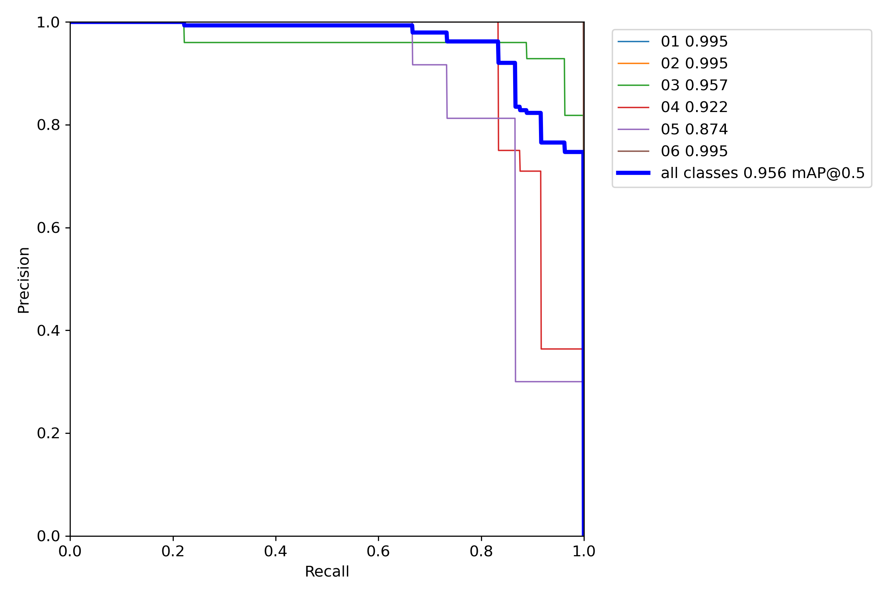
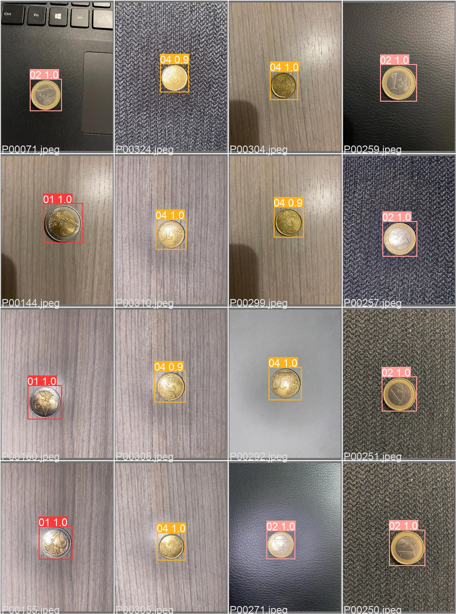

# Coin counter api with YOLOv5

This is a concept project, demonstrate how to use yolov5 detector to count coins in an image.

## Installation:

1.  `cd api/`
2.  `pip install -r requirements.txt`

## How to run the server:

`python api.py`

## How to use the API:

Send a post request to <api_base_url>/count with the "image": \<image>

## Results
## PR curve

## A sample image

# Reach us on Fiverr & Upwork

# Donations

If you found ***coin-counter-yolov5*** useful, please consider making a donation to support its ongoing development. Your contribution will help ensure that we can continue to provide updates and improvements to the app.

Developer paypal email: <leo.phibonacci@gmail.com>

Thank you for your support!
